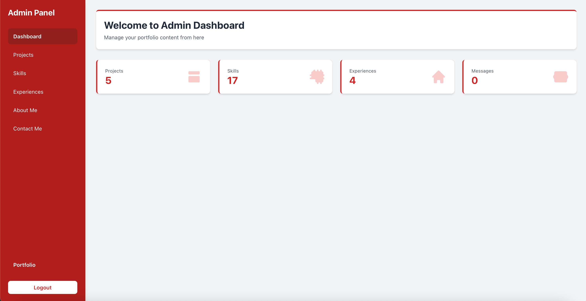
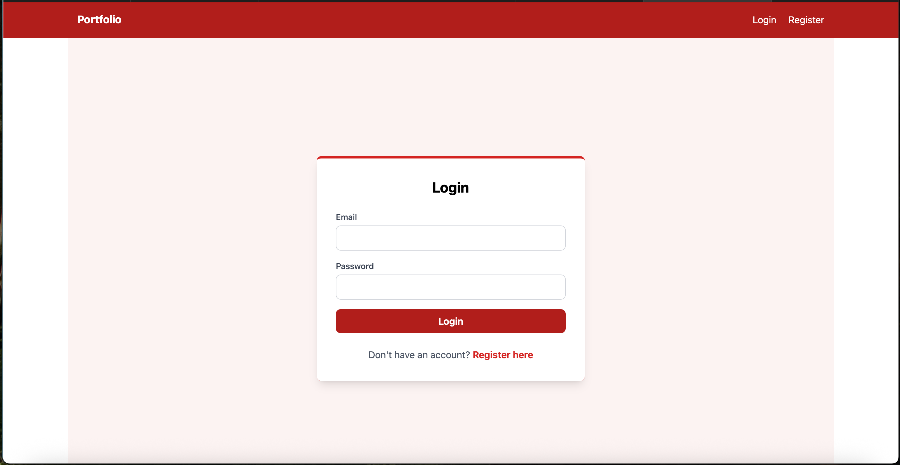
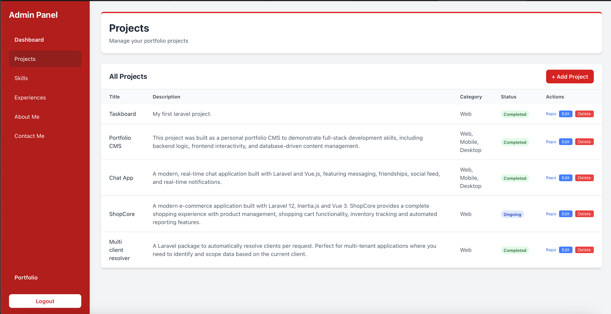
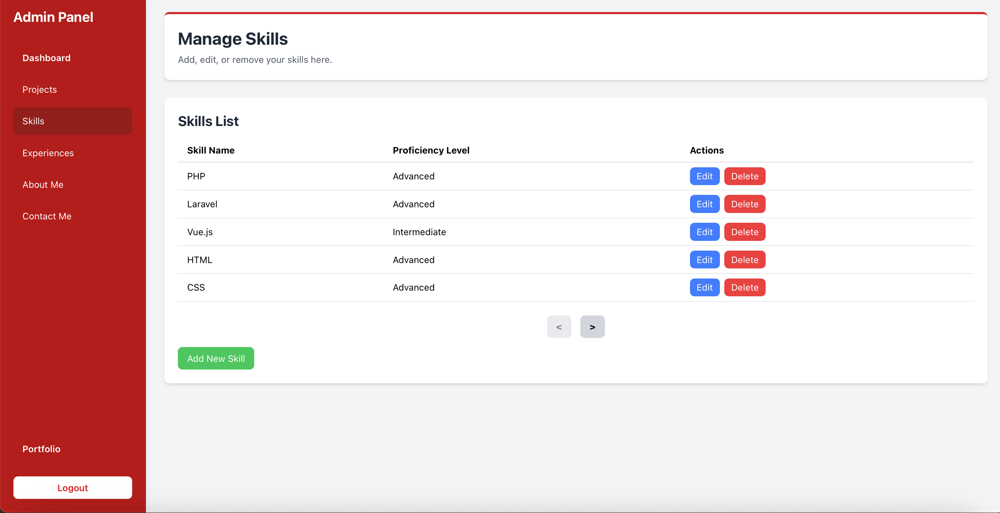
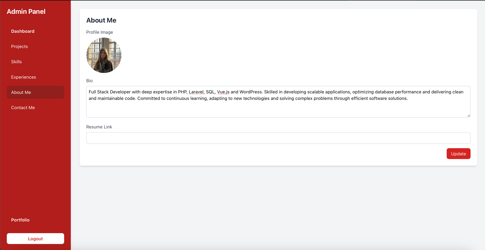
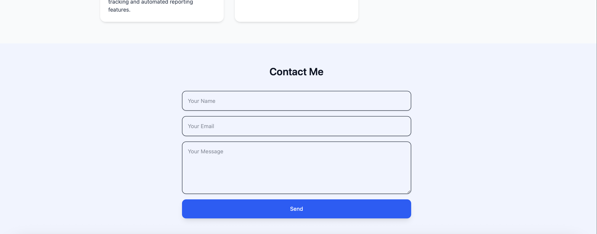
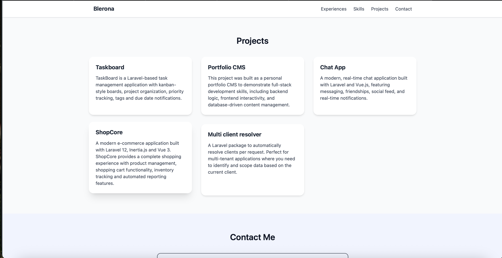
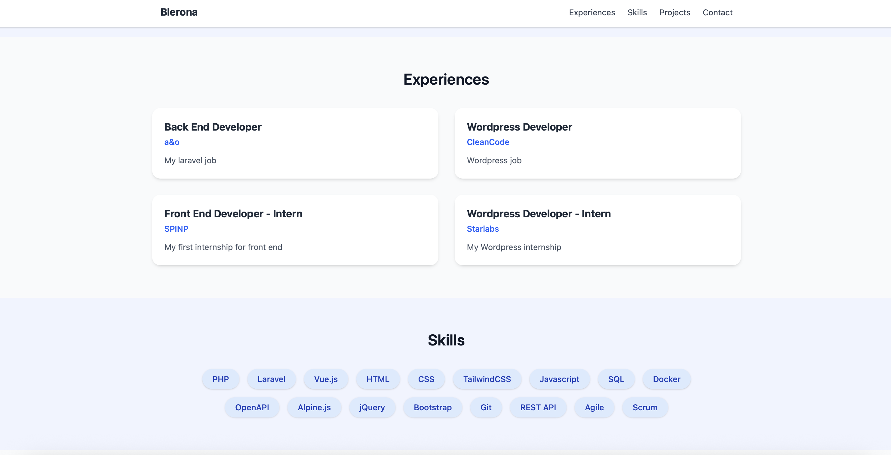
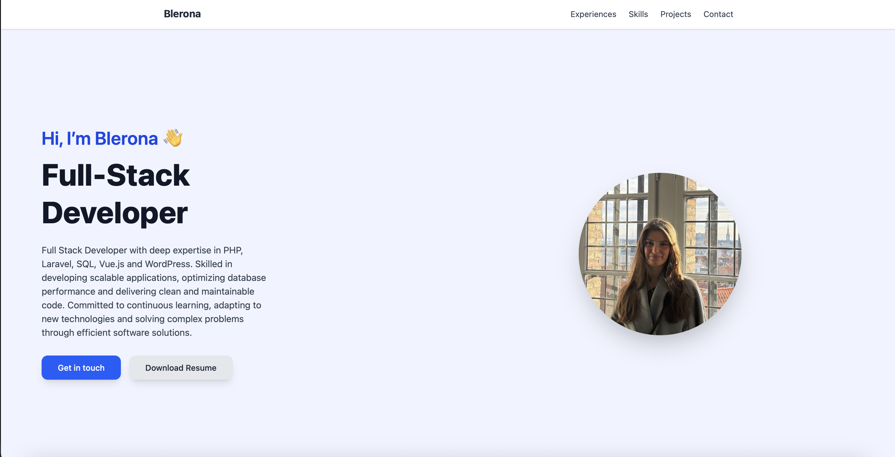

# Portfolio CMS

This is a CMS-based portfolio application built with **Laravel**, **Vue.js**, **Blade**, and **MySQL**.

## Features

### Admin Panel
- Secure authentication for administrators
- Manage skills, projects, experiences, and “About Me” content
- View overall statistics through a dashboard
- Receive and manage messages submitted via the contact form

### Client Side
- Fully dynamic portfolio website
- Content is automatically rendered based on data managed from the admin panel
- Clean and responsive user interface

## Tech Stack
- **Backend:** Laravel
- **Frontend:** Vue.js, Blade
- **Database:** MySQL
- **Build Tools:** Vite, npm

## Purpose
This project was built as a personal portfolio CMS to demonstrate full-stack development skills, including backend logic, frontend interactivity, and database-driven content management.

## Screenshots

### Admin Panel

#### Dashboard

#### Login/Register

#### Projects Management

#### Skills Management

#### Experiences Management

#### About Me Management

#### Contact Form Messages

### Client Side

#### Projects View

#### Experiences View

#### About Me View

